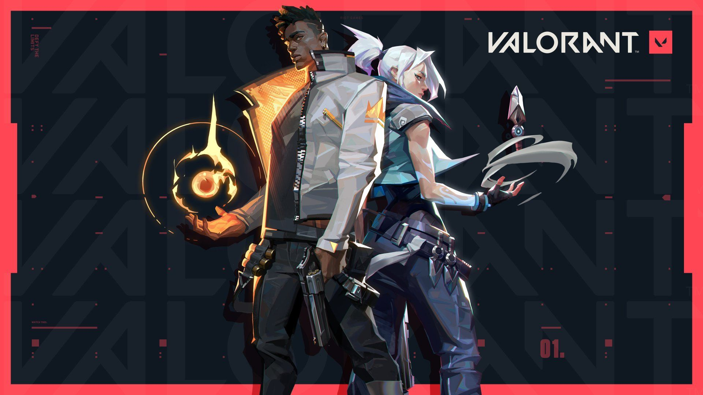

<!DOCTYPE html>
<html lang="en">
<head>
    <meta charset="UTF-8">
    <meta http-equiv="X-UA-Compatible" content="IE=edge">
    <meta name="viewport" content="width=device-width, initial-scale=1.0">
   
</head>

<HEADER>
  
 
     
 HIGHPOWER eSPORTS

    

 
  </HEADER>

<nav><a class="ar" href="http://www.google.com" target="_blank">HOME</a>
    <a class="ar" href="http://www.google.com" target="_blank">RESULTS</a>
    <a class="ar" href="http://www.google.com" target="_blank">TOURNAMENTS</a>
    <a class="ar" href="http://www.google.com" target="_blank">PAIDSCRIMS</a>
    <a class="ar" href="http://www.google.com" target="_blank">ROLES</a>
    <a class="ar" href="http://www.google.com" target="_blank">PROMOTION</a>
    <a class="ar" href="http://www.google.com" target="_blank">ABOUTUS</a>
    <a class="ar" href="http://www.google.com" target="_blank">POINTSTABLE</a>
    <input  type="search"  placeholder="Search" aria-label="Search" >
      <button class="search" type="submit" >search</button>
    
</nav><body>
  <Fieldset class="MOBILE">
    <Legend class="MOBG">MOBILE GAMING</Legend>
  

  
    

    

            
            
  <a class="hue" href="http://www.google.com">
                
PUBG

               </a>
       

       

          

            
            
 
                 <a class="hue" href="http://www.google.com">
                  
COD MOBILE

                 </a>
         

         

           

            
 <a class="hue" href="http://www.google.com">
             
FREEFIRE

            </a>
     

     

    

  

</Fieldset>
<Fieldset class="MOBILE">
  <Legend class="MOBG">PC GAMING</Legend>

  

  

          
          
  <a class="hue" href="http://www.google.com" target="_blank">
              
NFS

             </a>
     

     

        

          
          
 
               <a class="hue" href="http://www.google.com" target="_blank">
                
VALORANT

               </a>
       

       

         

          
 <a class="hue" href="http://www.google.com" target="_blank">
           
GOW4

          </a>
   

   

  

</Fieldset>
  <fieldset class="FIELD">
    <legend>GAMING NEWS</legend>
    
Lorem ipsum dolor sit amet consectetur adipisicing elit. Nam, impedit dicta? Quas, temporibus quo recusandae commodi minima non odio earum velit ipsa aut vero, distinctio neque sequi quidem, dolorum error?Lorem ipsum dolor sit amet consectetur adipisicing elit. Doloribus, atque! Velit praesentium error illo doloremque, numquam dignissimos alias, magni sapiente deserunt atque esse voluptas possimus sunt aliquam ducimus.Tenetur deleniti vero rerum dolor excepturi assumenda ut, corrupti qui dolorum!lorem1 Lorem ipsum dolor sit amet consectetur adipisicing elit. Nam quo veniam, in delectus similique a cumque, qui unde corrupti praesentium iure ullam cupiditate doloremque

    </fieldset>
   <footer class="foot">
     

       <h1>CCONTACT INFORMATION</h1>
       
 sep2000ankit@gmail.com   PHONE:+917253464728

      

      
     

    
   </footer>
        

     
            
</body>
</html>
